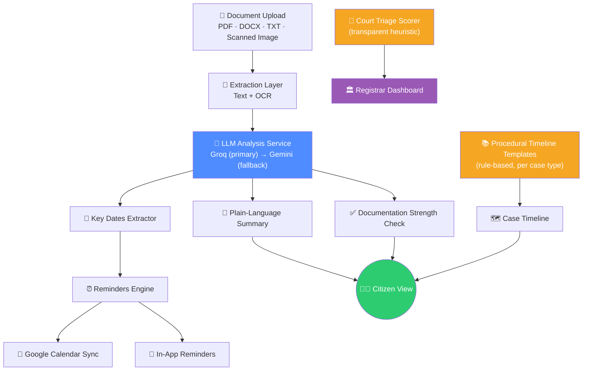

<div align="center">

# ⚖️ NyayaSetu

### *Bridging the gap between citizens and the justice system*

**न्याय** (nyaya) — justice · **सेतु** (setu) — bridge

An AI-powered legal-document intelligence platform that decodes legal notices, FIRs, and complaints in plain language for citizens — and gives court registrars a real-time triage dashboard to manage their case backlog.

[](https://www.python.org/)
[](https://fastapi.tiangolo.com/)
[](https://react.dev/)
[](https://www.mongodb.com/)
[](#license)

[Overview](#-overview) • [Features](#-features) • [Architecture](#-architecture) • [Setup](#-setup) • [Known Gaps](#-known-gaps--roadmap)

</div>

---

## 🧭 Overview

Legal processes are often opaque to the people they affect most. A citizen who receives a court notice or files an FIR rarely understands what it means, what happens next, or what deadlines they're facing — while court registrars are buried under case backlogs with no easy way to prioritize what's urgent.

**NyayaSetu** addresses both sides of that gap with a single document-understanding pipeline:

- 🧑‍⚖️ **For citizens** — upload a legal document and get a plain-language summary, your rights and obligations, a procedural timeline, and a documentation-strength checklist.
- 🏛️ **For court registrars** — a triage dashboard that scores and sorts the case backlog by urgency, so nothing critical slips through the cracks.
- 🔔 **For everyone** — deadlines and hearing dates extracted from documents can sync straight to Google Calendar, with in-app reminders as a fallback.

---

## ✨ Features

<table>
<tr>
<td width="50%" valign="top">

### 🧑‍⚖️ Citizen — "Understand My Case"
- 📤 Upload legal notices, FIRs, or complaints (PDF / DOCX / TXT, incl. scanned images via OCR)
- 📝 Plain-language case summary
- 📋 Rights & obligations breakdown
- 📅 Key dates & deadlines extracted automatically
- ✅ Documentation-strength checklist
- 🗺️ Procedural timeline for the case type

</td>
<td width="50%" valign="top">

### 🏛️ Registrar — Court Dashboard
- 📊 Case triage table with urgency scoring
- 🔍 Filter and sort the backlog by risk
- 🧮 Transparent, explainable scoring (case age, adjournments, doc completeness)
- 🗂️ Case registration & tracking

</td>
</tr>
<tr>
<td width="50%" valign="top">

### 🔔 Reminders & Calendar
- ⏰ Reminders auto-created from any deadline found in a document
- 🔗 One-click **Google Calendar** sync (OAuth2)
- 📌 In-app reminders work with zero setup

</td>
<td width="50%" valign="top">

### 🔐 Platform Foundations
- 🏢 Multi-tenant architecture with role-based access control
- 🌐 Multi-language document support (Hindi, Tamil, Telugu, Marathi, English)
- 🎙️ Voice-based query support
- 🐳 Dockerized for easy deployment

</td>
</tr>
</table>

---

## 🏗️ Architecture



> **Why two different engines for timelines vs. scoring?** A hallucinated legal deadline is the one failure mode that could genuinely harm someone — so the **procedural timeline is never LLM-generated**. It's a fixed, hand-authored sequence per case type; only the "current stage" and specific key dates come from the document itself. Similarly, the **court triage score is a transparent heuristic**, not a black-box model — every input to the score is visible and explainable, with a clear seam to swap in a trained model once real case-pendency data is available.

---

## 🛠️ Tech Stack

| Layer | Technology |
|---|---|
| **Frontend** | React, JavaScript |
| **Backend** | Python, FastAPI |
| **Database** | MongoDB (via Motor, async driver) |
| **LLM Services** | Groq (primary), Gemini (fallback) |
| **Calendar Integration** | Google Calendar API (OAuth 2.0) |
| **Auth & Access Control** | Multi-tenant context, role-based permissions |
| **Deployment** | Docker / docker-compose |

---

## 🚀 Setup

### Backend

```bash
cd backend
python -m venv venv
venv\Scripts\activate        # Windows
source venv/bin/activate     # Mac/Linux

pip install -r requirements.txt
cp .env.example .env         # then fill in GROQ_API_KEY etc.

uvicorn main:app --reload
```

### Frontend

```bash
cd frontend
npm install
cp .env.example .env

npm run dev
```

### 🔗 Google Calendar Sync (optional)

1. Open **Google Cloud Console** → create a new project → enable the **Google Calendar API**.
2. Create an OAuth 2.0 **Web application** Client ID.
3. Add `http://localhost:8000/api/v1/calendar/oauth/callback` under **Authorized redirect URIs**.
4. Add the client ID/secret to `backend/.env`.

> Skipping this is fine — reminders simply stay in-app until Calendar sync is configured.

---

## 📁 Project Structure

```
NyayaSetu/
├── backend/
│   ├── legal/                    # Case analysis, timeline templates, triage scorer
│   ├── reminders/                # Deadline-based reminder CRUD
│   ├── calendar_integration/     # Google Calendar OAuth2 + events
│   └── ...                       # Auth, RBAC, document extraction, LLM service
├── frontend/
│   └── src/pages/
│       ├── LegalAssistantPage.jsx    # "Understand My Case"
│       ├── RemindersPage.jsx         # Reminders + Calendar connect
│       └── CourtDashboardPage.jsx    # Registrar triage table
├── docker-compose.yml
└── README.md
```

---

## ⚠️ Known Gaps & Roadmap

Being upfront about the current state (useful context for interviews/demos):

- 🧮 **Court-triage scoring** is a heuristic today, not a trained ML model — designed with a clear seam to swap one in once real case-pendency data is available.
- 🔓 **Calendar OAuth tokens** are stored in MongoDB unencrypted for simplicity — should be encrypted at rest before use with real Google accounts.
- ✂️ **Document analysis prompt** caps input at ~12k characters — very long documents get truncated before analysis.
- 🧪 **No automated tests** yet for the newer modules — a priority before treating this as production-ready.

---

## 📄 License

This project is released under the [MIT License](LICENSE).

<div align="center">

**Built to make justice a little more legible.** ⚖️

</div>
